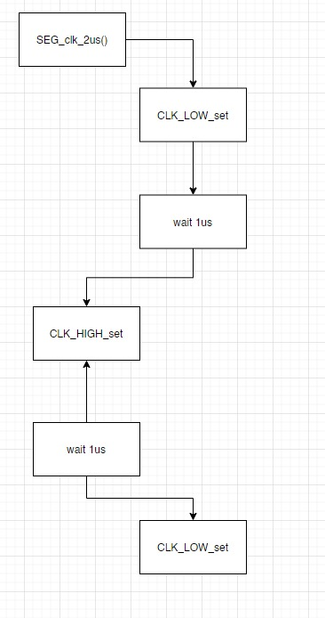

# Lab 5: VALENTIN CRISTEA

Link to your `Digital-electronics-2` GitHub repository:

   https://github.com/CristeaValentin/Digital-electronics-2


### 7-segment library

1. In your words, describe the difference between Common Cathode and Common Anode 7-segment display.
   * CC SSD - In the common cathode display, all the cathode connections of the LED segments are joined together to logic “0”. 
The individual segments are illuminated by applying a voltage, logic “1” or “HIGH” signal via a 
suitable current limiting resistor to the Anode of the particular segment

   * CA SSD -  In the common anode display, all the anode connections of the LED segments are joined together to logic “1”. 
The individual segments are illuminated by applying a ground, logic “0” or “LOW” signal via a 
suitable current limiting resistor to the Cathode of the particular segment

The difference between the two displays is the common cathode has all the cathodes of the 7-segments connected directly 
together and the common anode has all the anodes of the 7-segments connected together. The common cathode is acive HIGH and the common anode is active LOW.

2. Code listing with syntax highlighting of two interrupt service routines (`TIMER1_OVF_vect`, `TIMER0_OVF_vect`) from counter application with at least two digits, ie. values from 00 to 59:

```c
/************************
 * Function: Timer/Counter1 overflow interrupt
 * Purpose:  Increment counter value from 00 to 59.
 ************************/
ISR(TIMER1_OVF_vect)
{   
    // WRITE YOUR CODE HERE
    static uint8_t val0=0,val1=0;
    
    val++;
    if(val0==10) //after it reaches 10, it resets to 0 and increments the tens of seconds
        {val0=0;
        val1++;
        }
    if(val1==6)  //it increments the tens of seconds until they reach 6
        val1=0;      
}
```

```c
/************************
 * Function: Timer/Counter0 overflow interrupt
 * Purpose:  Display tens and units of a counter at SSD.
 ************************/
ISR(TIMER0_OVF_vect)
{
    static uint8_t pos = 0; 
    pos++;
    if(pos!=0){
        pos=0;
        SEG_update_shift_regs(val0,pos); 
    }
    else
        SEG_update_shift_regs(val1,pos);
}
```

3. Flowchart figure for function `SEG_clk_2us()` which generates one clock period on `SEG_CLK` pin with a duration of 2&nbsp;us. The image can be drawn on a computer or by hand. Use clear descriptions of the individual steps of the algorithms.

   


### Kitchen alarm

Consider a kitchen alarm with a 7-segment display, one LED and three push buttons: start, +1 minute, -1 minute. Use the +1/-1 minute buttons to increment/decrement the timer value. After pressing the Start button, the countdown starts. The countdown value is shown on the display in the form of mm.ss (minutes.seconds). At the end of the countdown, the LED will start blinking.

1. Scheme of kitchen alarm; do not forget the supply voltage. The image can be drawn on a computer or by hand. Always name all components and their values.

   
